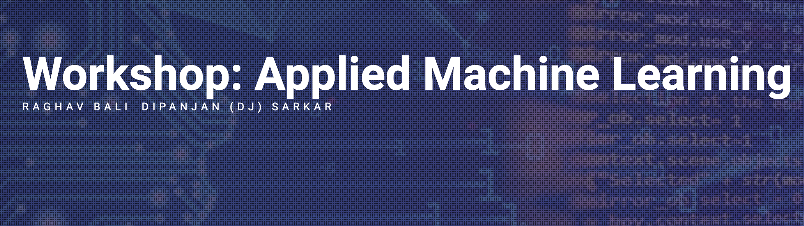
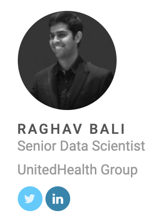
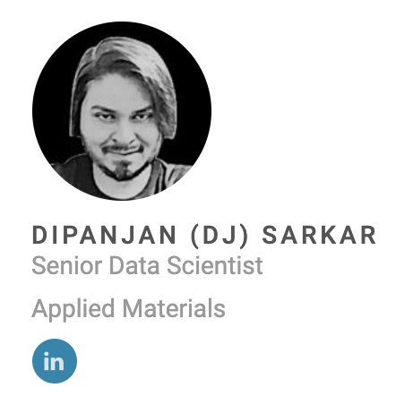

# Workshop: Applied Machine Learning
Workshop @ DataHack Summit 16 November,2019

---

Have you ever wondered how to apply machine learning to business problems? This workshop is specially designed to help learn the concepts, tools and techniques involved. You will go through real-life case studies and experience how this is done in the industry. The focus of this workshop will be on the machine learning pipeline data cleaning, feature engineering, model building and evaluation. You will also learn how to structure a business problem as an ML problem, and then go on to build, select and evaluate the model.

---
## Pre-requisites
+ System Requirement and Setup
    - Laptop with at least 4-8 GB of RAM
    - We will be using Google Colab for the workshop, hence make sure you have a google login and space on your google drive
+ Offline Setup [Optional]
    - GPU good to have but optional
    - Install Anaconda [link](https://docs.anaconda.com/anaconda/install/)
    - Install Python3.6 on Anaconda [link](https://docs.anaconda.com/anaconda/user-guide/faq/#anaconda-faq-35)
+ Pre-reads
    - Programming knowledge in Python (Python: [link](https://www.analyticsvidhya.com/blog/2016/01/complete-tutorial-learn-data-science-python-scratch-2/))
    - Jupyter Notebook Environment familiarity ([link1](https://www.analyticsvidhya.com/blog/2018/05/starters-guide-jupyter-notebook/), [link2](https://github.com/amitkaps/art-data-science))
    - Basics of Machine learning ([link](https://www.analyticsvidhya.com/blog/2017/09/common-machine-learning-algorithms/))
    - Google Colab Intro ([link](https://colab.research.google.com/notebooks/basic_features_overview.ipynb))

  ----
  ## Authors
  
